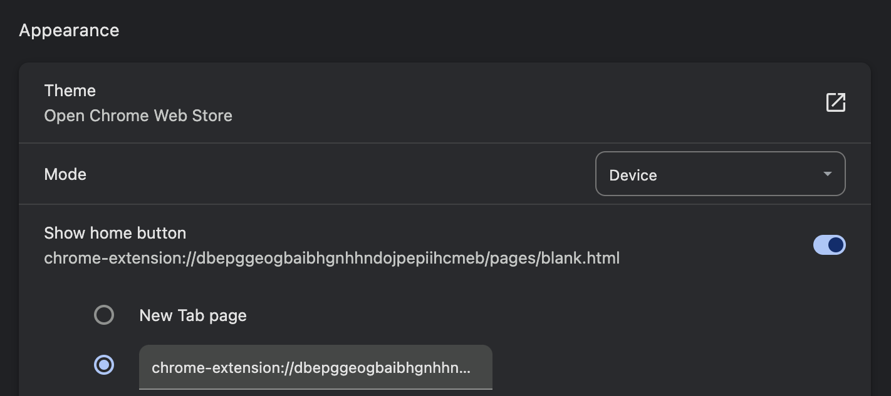
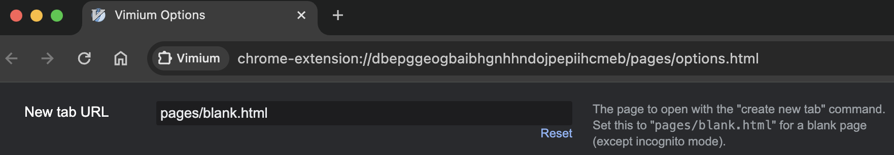
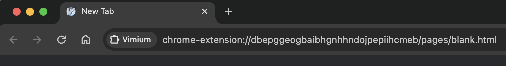
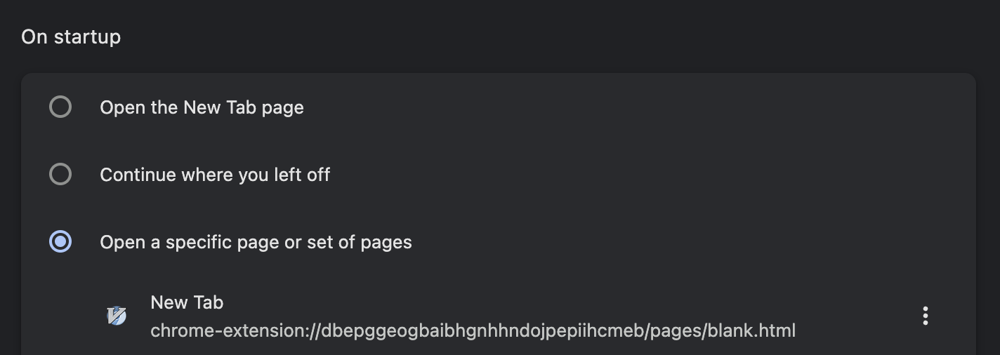

# How to override Google Chrome homepage, startup, and New Tab pages

## Chrome homepage & startup pages

Please note, I'm using vimium extension blank page because its css handles os switching between light and dark modes for me

Step 1: Enable home button, and set home page url to
`chrome-extension://dbepggeogbaibhgnhhndojpepiihcmeb/pages/blank.html` as shown below



> Note
> the extension id part of the url maybe different. However, to get it, please go to vimium options ui, and set new tab to pages/blank.html. Then, open a new tab from vimium by typing <kbd>t</kbd>. You should find the link in the url bar as shown below
> 
> 
> 
> 

Step 2: Setup On startup

Setup on startup to the same link from above



## New Tab

Step 1: Create a new chrome extension with the following contents

``` json
// manifest.json
{
    "manifest_version": 3,
    "name": "Medhat New Tab",
    "version": "1",
    "chrome_url_overrides": {
        "newtab": "index.html"
    }
}
```

``` html
<!-- index.html -->
<!DOCTYPE html>

<head>
    <title>New Tab</title>
    <meta http-equiv="refresh" content="0; url=https://medhatessmat.github.io/my_home_page/" />
    <link rel="stylesheet" type="text/css" href="main.css" />
    <link rel="shortcut icon" type="image/jpg" href="home-solid.svg" />
</head>

<body>
</body>

</html>
```

``` css
/* main.css */
@media (prefers-color-scheme: dark) {
    iframe.reverseDarkReaderFilter {
        -webkit-filter: invert(100%) hue-rotate(180deg) !important;
        filter: invert(100%) hue-rotate(180deg) !important;
    }

    body {
        background-color: #292a2d;
        color: white;
    }
}
```

to learn how to load it in chrome, see this yt [video](https://www.youtube.com/watch?v=vNb3P5KIxXw)

Step 2: create a static website on github pages with same contents except after removing the page redirect from the `index.html` file as shown below

``` diff
- <meta http-equiv="refresh" content="0; url=https://medhatessmat.github.io/my_home_page/" />
```